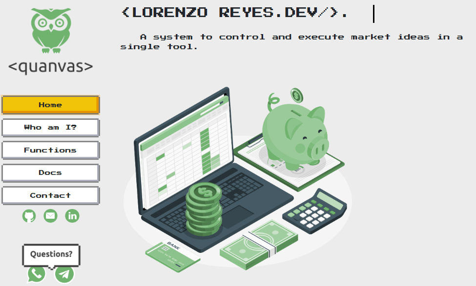

# Lorenzo Reyes Website

## **A reformulation and debugging of the code of the original project was done from 0, being able to leave the page in a correct, light and tidy way so that it can be visible in different resolutions and devices. We used ReactsJS and NES.css and Framer-motion as libraries.**

---

---

# Getting Started with Create React App

This project was bootstrapped with [Create React App](https://github.com/facebook/create-react-app).

## Available Scripts

In the project directory, you can run:

### `npm start`

Runs the app in the development mode.\
Open [http://localhost:3000](http://localhost:3000) to view it in your browser.

The page will reload when you make changes.\
You may also see any lint errors in the console.

